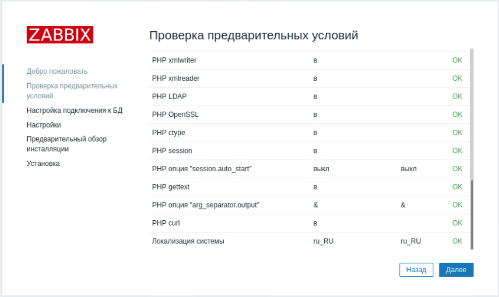
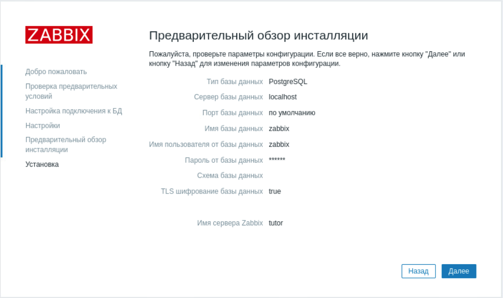
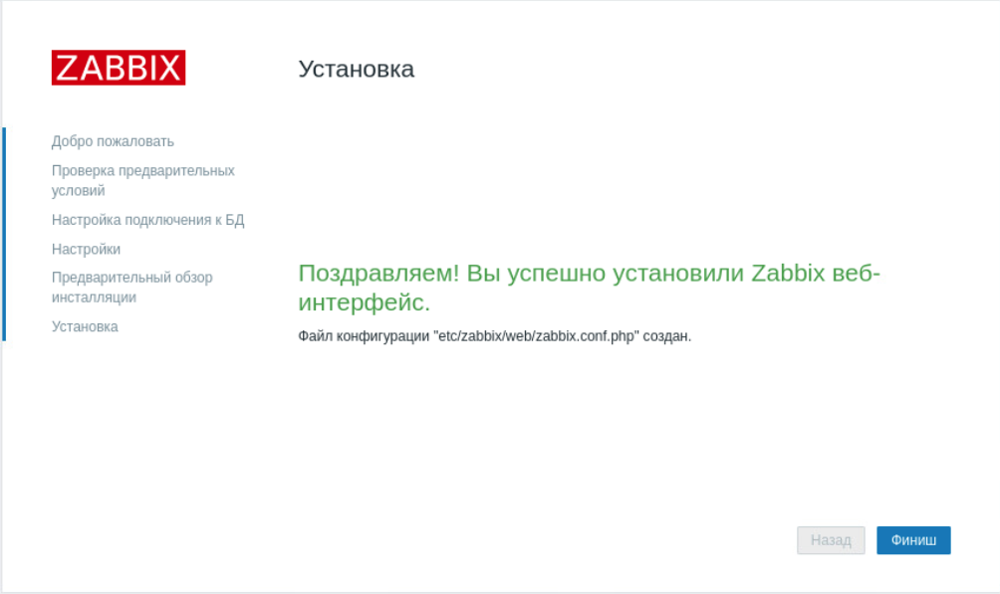
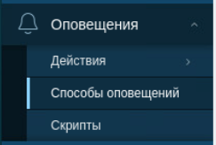
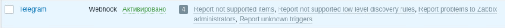
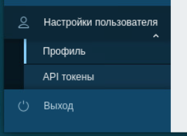
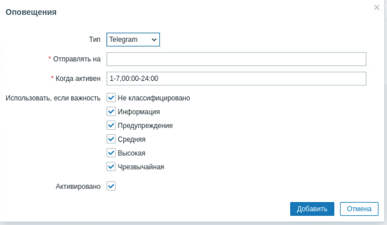
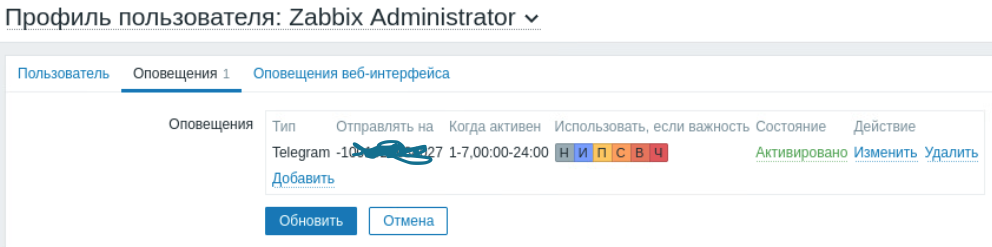

## Модуль 1: Введение в Zabbix

**Задание: Настройка и обзор пользовательского интерфейса Zabbix**

---
### Практическая работа

1. Подготовьте сервер zabbix

Отключите пакеты Zabbix, предоставляемые EPEL, если они у вас установлены. Отредактировать файл /etc/yum.repos.d/epel.repo и добавьте следующее утверждение.

```
[epel]
...
excludepkgs=zabbix*
```

2. Добавьте репозиторий Zabbix:
```bash
rpm -Uvh https://repo.zabbix.com/zabbix/7.0/alma/9/x86_64/zabbix-release-latest-7.0.el9.noarch.rpm

dnf clean all
```
3. Установите Zabbix сервер, веб-интерфейс и агент:
```bash
dnf install zabbix-server-pgsql zabbix-web-pgsql zabbix-apache-conf zabbix-sql-scripts zabbix-selinux-policy zabbix-agent
```

4. Создайте базу данных и пользователя для Zabbix:
```bash
sudo -u postgres createuser --pwprompt zabbix
```
> На запрос пароля задайте "zabbix" (введите без кавычек, это пароль для пользователя бд)

```bash
sudo -u postgres createdb -O zabbix zabbix
```

5. На хосте сервера Zabbix импортируйте исходную схему и данные. Вам будет предложено ввести только что созданный пароль.:
```bash
zcat /usr/share/zabbix-sql-scripts/postgresql/server.sql.gz | sudo -u zabbix psql zabbix
```

6. Настройте файл конфигурации Zabbix сервера:
```bash
sudo vim /etc/zabbix/zabbix_server.conf
```
Убедитесь, что следующие параметры установлены:
```
DBHost=localhost
DBName=zabbix
DBUser=zabbix
DBPassword=zabbix
```

7. Перезапустите службы Zabbix и Apache:
```bash
systemctl restart zabbix-server zabbix-agent httpd php-fpm
sudo systemctl zabbix-server zabbix-agent httpd php-fpm
```

8. Откройте порт в firewalld (если требуется)
```bash
sudo firewall-cmd --permanent --add-service=http
sudo firewall-cmd --reload
```

9.  Откройте веб-интерфейс Zabbix:
Перейдите в браузере по адресу `http://<your-server-ip>/zabbix` и следуйте инструкциям для завершения установки.

- Шаг 1


- Шаг 2


- Шаг 3


- Шаг 4


- Шаг 5


- Шаг 6



10.   Войдите в систему:
Откройте веб-интерфейс Zabbix `http://<your-server-ip>/zabbix`. Введите ваши учетные данные для входа (Admin/zabbix). 

---
### Лабораторная работа
**Настройка использования внешнего сервера БД.**

11.  Настройте файл конфигурации Zabbix сервера для подключения к другому серверу БД:
```bash
sudo vim /etc/zabbix/zabbix_server.conf
```
Убедитесь, что следующие параметры установлены:
```
DBHost=10.0.20.3
DBName=zabbix
DBUser=zabbix
DBPassword=zabbix
```
12.  Удалите ранее созданную конфигурацию для zabbix-frontend
```bash
cd /etc/zabbix/web/

mv zabbix.conf.php zabbix.conf.php.old
```

13. Перезапустите службы Zabbix и Apache:
```bash
systemctl restart zabbix-server zabbix-agent httpd php-fpm
```

14. Подготовьте сервер Postgresql на zabbix-db

Отключите пакеты Zabbix, предоставляемые EPEL, если они у вас установлены. Отредактировать файл /etc/yum.repos.d/epel.repo и добавьте следующее утверждение.

```
[epel]
...
excludepkgs=zabbix*
```

15. Добавьте репозиторий Zabbix:
```bash
rpm -Uvh https://repo.zabbix.com/zabbix/7.0/alma/9/x86_64/zabbix-release-latest-7.0.el9.noarch.rpm

dnf clean all
```

16. Установите sql-скрипты, веб-интерфейс и агент:
```bash
dnf install zabbix-web-pgsql zabbix-apache-conf zabbix-sql-scripts zabbix-selinux-policy zabbix-agent
```

17. Создайте базу данных zabbix и пользователя zabbix для Zabbix-сервера.
> На запрос пароля задайте "zabbix" (введите без кавычек, это пароль для пользователя бд)

18. На хосте сервера БД импортируйте исходную схему и данные. Вам будет предложено ввести только что созданный пароль.

19. Откройте веб-интерфейс Zabbix:
Перейдите в браузере по адресу `http://<your-server-ip>/zabbix` и следуйте инструкциям для завершения установки.

---
### Практическая работа

20. **Настройте уведомления:**
> Предварительно получите данные от тренера для настройки уведомлений в Telegram

- перейдите в Оповещения -> Способы оповещений

- выберите Telegram и `активируйте` его

- Нажмите на ссылку `Telegram` чтобы перейти в настройки
- Укажите токен в поле `Параметры - Token:`

- Нажмите `обновить` и затем ссылку `Тест` для отправки тестового сообщения (в поле `Subject:` укажите свою фамилию, в поле `To:` Укажите ID для чата)

21. **Настройте персонализированный профиль пользователя**:
- Перейдите в настройки профиля, чтобы обновить информацию о пользователе и сохраните изменения.

- На вкладке `Пользователь` установите ваш локальный часовой пояс
- На вкладке `Оповещения` нажмите `Добавить` и выберите `Telegram`
- В поле `Отправлять на` Укажите ID чата и нажмите `Добавить`

- Нажмите `обновить` 
  

Изучите основные компоненты интерфейса:
Ознакомьтесь с панелью управления.
Изучите основные вкладки и их функции.

1.  **Создайте новый элемент:**
Перейдите в раздел "Элементы".
Нажмите "Создать новый элемент" и заполните необходимые поля.

1.  **Создайте новый триггер:**
Перейдите в раздел "Триггеры".
Нажмите "Создать новый триггер" и задайте условия срабатывания.

1.  **Настройте уведомления:**
Перейдите в раздел "Уведомления".
Настройте правила отправки уведомлений при срабатывании триггеров.

Проверьте работу созданных элементов и триггеров:
Убедитесь, что элементы и триггеры работают корректно.
Проведите тестирование и устраните возможные ошибки.

24. **Изучите журнал событий:**
Перейдите в раздел "Журнал событий".
Ознакомьтесь с записями и анализируйте произошедшие события.

Подготовьте отчет о проделанной работе:
Составьте отчет, включающий все выполненные шаги и результаты тестирования.

