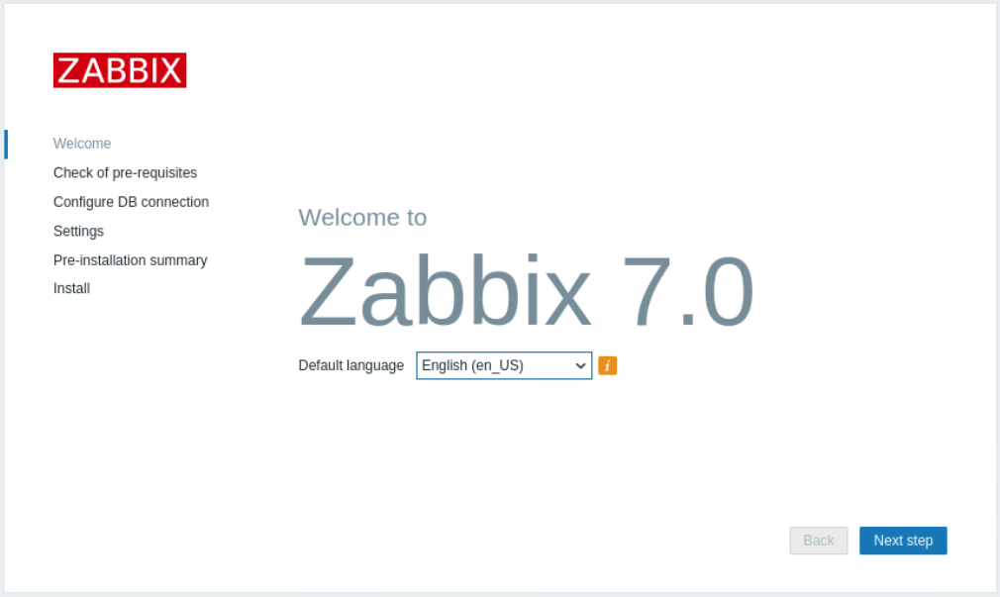
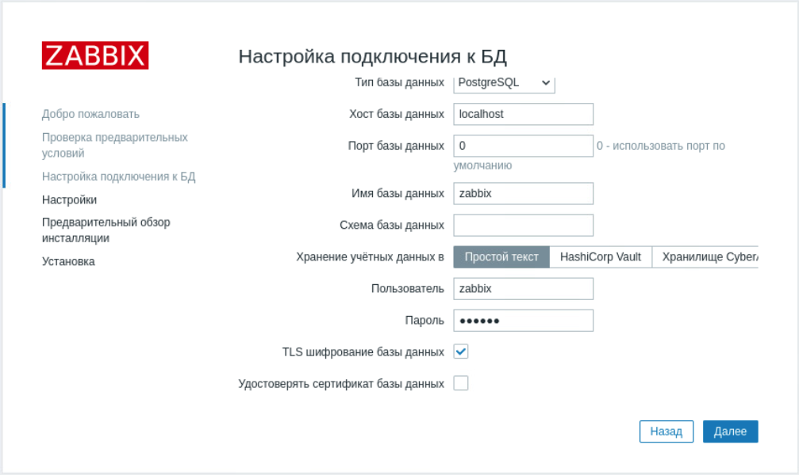
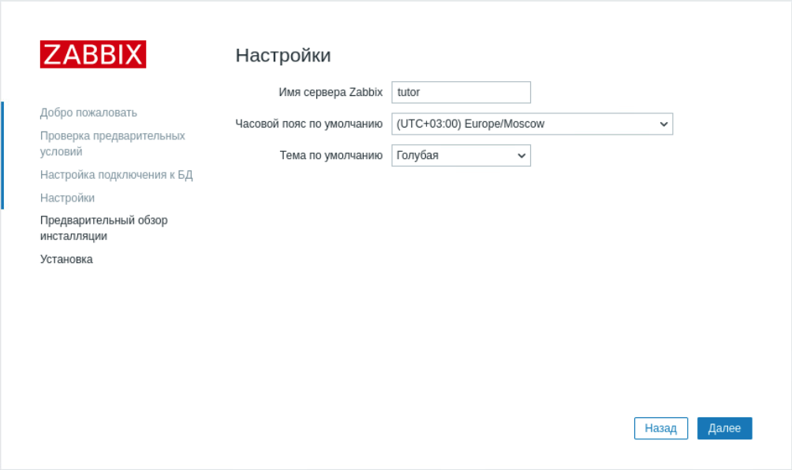
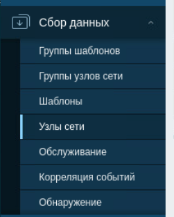
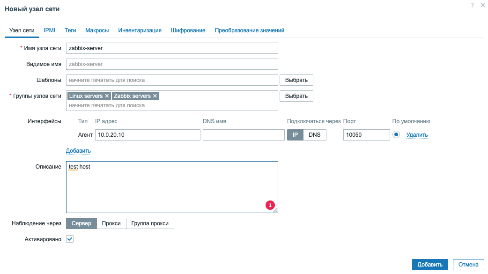
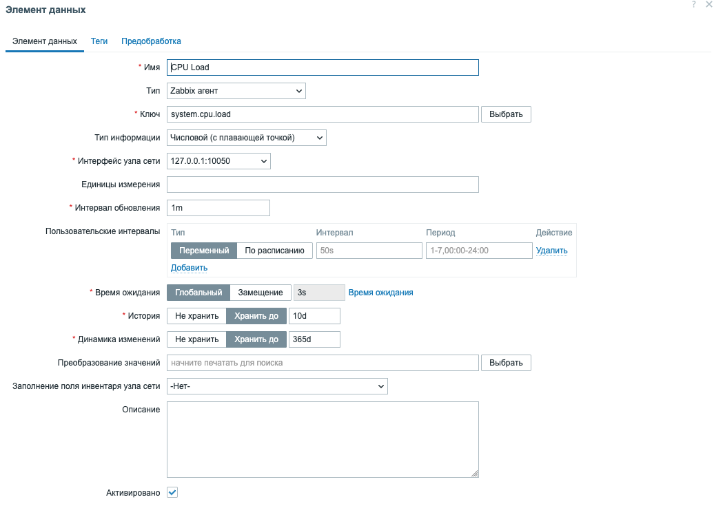
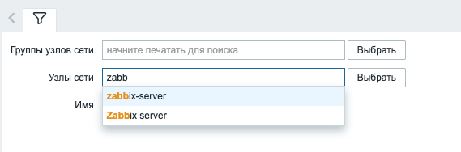
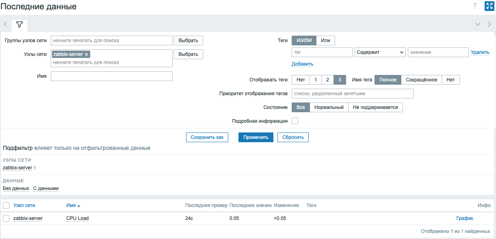
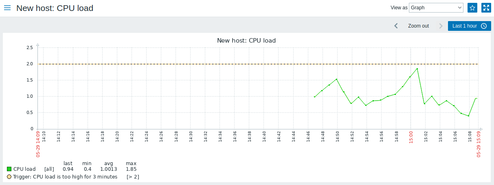

## Модуль 1: Введение в Zabbix

**Задание: настройка и обзор пользовательского интерфейса Zabbix**

---
**План:** 
- Установите Zabbix. 
- Войдите в систему. 
- Настройте персонализированный профиль пользователя. 
- Изучите основные компоненты интерфейса. 
- Создайте новый элемент. 
- Изучите журнал событий. 
---

### Практическая работа

1. Подготовьте сервер zabbix. Подключитесь к ВМ **02-zabbix_server**.

> **Рекомендация:** Для работы по ssh с виртуальными машинами стенда, используйте подключение по ssh к ВМ 01-gw (уточните адрес в веб-интерфейсе вашей системы виртуализации) и затем с нее подключитесь по ssh к  ВМ 02,03,04... используя адреса из сети 10.0.0.0/16

> **Рекомендация:** для подключения к web-интерфейсу zabbix можно воспользоваться пробросом портов (-D или -L) через ssh-туннель к ВМ 01-wg

Отключите пакеты Zabbix, предоставляемые EPEL, если они у вас установлены. Отредактируйте файл /etc/yum.repos.d/epel.repo и добавьте следующее утверждение:

```
[epel]
...
excludepkgs=zabbix*
```
**Возможно** репозиториев **epel** несколько, проверьте и исправьте все активные. 

2. Добавьте репозиторий Zabbix:
```bash
rpm -Uvh https://repo.zabbix.com/zabbix/7.0/alma/9/x86_64/zabbix-release-latest-7.0.el9.noarch.rpm

dnf clean all
```
3. Установите Zabbix-сервер, веб-интерфейс и агент:
```bash
dnf install zabbix-server-pgsql zabbix-web-pgsql zabbix-apache-conf zabbix-sql-scripts zabbix-selinux-policy zabbix-agent
```

4. Создайте базу данных (БД) и пользователя для Zabbix:
```bash
sudo -u postgres createuser --pwprompt zabbix
```
> На запрос пароля задайте "zabbix" (введите без кавычек, это пароль для пользователя БД)

```bash
sudo -u postgres createdb -O zabbix zabbix
```

5. На хосте сервера Zabbix импортируйте исходную схему и данные. Вам будет предложено ввести только что созданный пароль:
```bash
zcat /usr/share/zabbix-sql-scripts/postgresql/server.sql.gz | sudo -u zabbix psql zabbix
```

6. Настройте файл конфигурации Zabbix-сервера:
```bash
sudo vim /etc/zabbix/zabbix_server.conf
```
Убедитесь, что следующие параметры установлены:
```
DBHost=localhost
DBName=zabbix
DBUser=zabbix
DBPassword=zabbix
```

7. Перезапустите службы Zabbix и Apache, добавьте их в автозапуск:
```bash
systemctl restart zabbix-server zabbix-agent httpd php-fpm
systemctl enable zabbix-server zabbix-agent httpd php-fpm
```

8. Откройте порт в firewalld (если требуется):
```bash
sudo firewall-cmd --permanent --add-service=http
sudo firewall-cmd --permanent --add-service=zabbix-server
sudo firewall-cmd --permanent --add-service=zabbix-agent
sudo firewall-cmd --reload
```

9. Используйте рабочий стол ВМ **00-ws** или проброс портов (`ssh -L 8080:10.0.20.10:80 your_gw_ip`). Откройте веб-интерфейс Zabbix:
перейдите в браузере по адресу `http://<your-server-ip>/zabbix` и следуйте инструкциям для завершения установки.

- Шаг 1


- Шаг 2


- Шаг 3


- Шаг 4 (В поле **Имя сервера Zabbix** укажите свою фамилию на латинице)


- Шаг 5


- Шаг 6


10.   Войдите в систему:
откройте веб-интерфейс Zabbix `http://<your-server-ip>/zabbix`. Введите ваши учетные данные для входа (Admin/zabbix). 

---
### Лабораторная работа
#### **Настройка использования внешнего сервера БД.**

11. Подключитесь к ВМ **02-zabbix_server**. Настройте файл конфигурации Zabbix-сервера для подключения к другому серверу БД:
```bash
sudo vim /etc/zabbix/zabbix_server.conf
```
Убедитесь, что следующие параметры установлены:
```
DBHost=10.0.20.3
DBName=zabbix
DBUser=zabbix
DBPassword=zabbix
```
12.  Удалите ранее созданную конфигурацию для zabbix-frontend
```bash
cd /etc/zabbix/web/

mv zabbix.conf.php zabbix.conf.php.old
```

13. Перезапустите службы Zabbix и Apache:
```bash
systemctl restart zabbix-server zabbix-agent httpd php-fpm
```

14. Подключитесь к ВМ **03-zabbix_db**. Подготовьте сервер Postgresql на zabbix-db

Отключите пакеты Zabbix, предоставляемые EPEL, если они у вас установлены. Отредактируйте файл /etc/yum.repos.d/epel.repo и добавьте следующее утверждение.

```
[epel]
...
excludepkgs=zabbix*
```

15. Добавьте репозиторий Zabbix:
```bash
rpm -Uvh https://repo.zabbix.com/zabbix/7.0/alma/9/x86_64/zabbix-release-latest-7.0.el9.noarch.rpm

dnf clean all
```

16. Установите sql-скрипты, веб-интерфейс и агент:
```bash
dnf install zabbix-web-pgsql zabbix-apache-conf zabbix-sql-scripts zabbix-selinux-policy zabbix-agent
```

17. Создайте базу данных zabbix и пользователя zabbix для Zabbix-сервера.
> На запрос пароля задайте "zabbix" (введите без кавычек, это пароль для пользователя БД)

18. На хосте сервера БД импортируйте исходную схему и данные. Вам будет предложено ввести только что созданный пароль.

19. Используйте рабочий стол ВМ **00-ws** или проброс портов (`ssh -L 8080:10.0.20.10:80 your_gw_ip`). Откройте веб-интерфейс Zabbix:
перейдите в браузере по адресу `http://<your-server-ip>/zabbix` и следуйте инструкциям для завершения установки. На экране "Настройка подключения к БД" укажите ip-адрес сервера БД `10.0.20.3`.

---
### Практическая работа


#### Создайте новый узел сети

22. **Добавьте новый узел**. Используйте рабочий стол ВМ **00-ws** или проброс портов (`ssh -L 8080:10.0.20.10:80 your_gw_ip`).
- Перейдите в меню `Сбор данных → Узлы сети`



- Нажмите `Создать узел сети`
- Заполните поля помеченные звездочками как в примере на скриншоте (для имени узла используйте имя `zabbix-server-vasha_familia`)



- в поле Интерфейс нажмите `Добавить → Агент`  и задайте ip-адрес zabbix-сервера 
- убедитесь что галочка `Активировано` включена и нажмите `Добавить`


#### Настройте новый элемент данных
Элементы данных лежат в основе сбора данных в Zabbix. Без элементов данных нет данных — потому что элемент данных определяет только одну метрику, или какого рода данные собираются с узла сети.


23.  **Добавьте элемент данных**
- Перейдите в меню `Сбор данных → Узлы сети`


- Найдите узел сети «zabbix-server», который мы ранее создали.
- Нажмите на ссылке Элементы данных в строке с «zabbix-server» и затем нажмите на Создать элемент данных. Отобразится диалог создания элемента данных.
- Заполните поля помеченные звездочками



> Введите информацию, необходимую для нашего примера элемента данных:
> **Имя**: введите значение Загрузка CPU. Это имя будет отображаться как имя элемента данных в списках и в других местах.
> **Ключ**: вручную введите значение system.cpu.load. Это техническое имя элемента данных, которое идентифицирует тип информации, которая будет собираться. Этот ключ является лишь одним из предопределённых ключей, которые поставляются с Zabbix агентом.
>**Тип информации**: этот атрибут определяет формат ожидаемых данных. Для ключа system.cpu.load этот поле автоматически примет значение Числовой (с плавающей точкой).

24. Просмотрите собранные данные
- Для просмотра графика перейдите к `Мониторинг → Последние данные` и нажмите на ссылку «График» у нужного элемента данных. Для выбора ранее созданного узла в поле `Узлы сети` укажите zabbix-server

Шаг 1:



Шаг 2:



График:



25. Если данные не обновляются и график пустой, то обратите внимание на содержимое файла `/var/log/zabbix/zabbix_agentd.log`
```log
student@zabbix-server:~$sudo tail -f /var/log/zabbix/zabbix_agentd.log
  2721:20250527:125233.381 failed to accept an incoming connection: connection from "10.0.20.10" rejected, allowed hosts: "127.0.0.1"
  2720:20250527:125334.381 failed to accept an incoming connection: connection from "10.0.20.10" rejected, allowed hosts: "127.0.0.1"
  2722:20250527:125732.380 failed to accept an incoming connection: connection from "10.0.20.10" rejected, allowed hosts: "127.0.0.1"
  2720:20250527:125747.381 failed to accept an incoming connection: connection from "10.0.20.10" rejected, allowed hosts: "127.0.0.1"
  2725:20250527:125802.381 failed to accept an incoming connection: connection from "10.0.20.10" rejected, allowed hosts: "127.0.0.1"
```

26. Внесите изменения в файл `/etc/zabbix/zabbix_agentd.conf`. Найдите и исправьте строку начинающуюся на `Server=`
```ini
Server=127.0.0.1,10.0.20.10
```

27. Перезапустите **zabbix-agent**
```bash
sudo systemctl restart zabbix-agent.service
```
В журнале агента не должно быть ошибок:
```ini
 student@zabbix-server:~$sudo tail -f /var/log/zabbix/zabbix_agentd.log
  5498:20250527:131241.251 agent #10 started [listener #9]
  5497:20250527:131241.253 agent #9 started [listener #8]
  5493:20250527:131241.253 agent #5 started [listener #4]
  5495:20250527:131241.253 agent #7 started [listener #6]
  5496:20250527:131241.255 agent #8 started [listener #7]
  5499:20250527:131241.255 agent #11 started [listener #10]
  5491:20250527:131241.256 agent #3 started [listener #2]
  5500:20250527:131241.257 agent #12 started [active checks #1]
  5492:20250527:131241.259 agent #4 started [listener #3]
  5494:20250527:131241.259 agent #6 started [listener #5]
  ```

28. Вернитесь к шагу **24** и дождитесь обновления данных