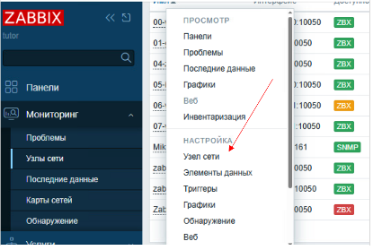
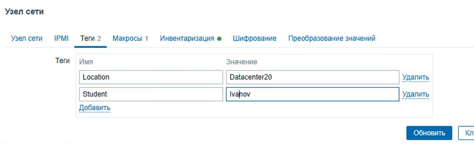

## Модуль 2: Настройка и управление хостами

**Задание: создание и настройка хоста в Zabbix.**

---

**План:** 
-	Создайте новый хост.
-	Настройте параметры хоста.
-	Добавьте пользовательские макросы.
-	Добавьте теги.
-	Настройте сбор данных с использованием простых проверок.
-	Настройте сбор данных с использованием SSH проверок.
-	Установите и настройте агент Zabbix.
-	Проверьте работу агента.
-	Настройте плагины Zabbix agent2.
-	Подготовьте отчет о проделанной работе.

---

### Практическая работа 2.1
---

#### 1. **Добавьте новый хост**
1. Перейдите в **Мониторинг → Узлы сети**.  
2. Нажмите кнопку **Создать узел сети**.  
3. Укажите **Имя хоста** `zabbix-db` (полное имя хоста на вашем стенде может отличаться, но должно включать слово «zabbix-db»).  
4. В поле **Группы** выберите или создайте группу (`Linux Servers`,`Databases`,`Familiya`).  
5. В разделе **Интерфейсы** добавьте интерфейс:  
   - для мониторинга через агент укажите **IP-адрес** 10.0.20.3 и порт **10050**.  
  
6. Нажмите **Добавить** справа в нижней части окна.  

#### 2. **Настройте параметры хоста**  
1. Откройте созданный узел `zabbix-db` (перейдите в **Мониторинг → Узлы сети**).  
2. Нажмите на имя узла и в разделе **Настройки** выбирете **Узел сети**.



3. Проверьте правильность настроек группы, интерфейсов и имени хоста.  
4. В поле **Шаблоны** добавьте нужные шаблоны:  
   - начните писать `Linux` (для мониторинга Linux by Zabbyx Agent); 
   - начните писать `Postgresql` (для мониторинга Postgresql by Zabbyx Agent 2). 
5. Сохраните изменения нажав **Обновить**.  

#### 3. **Добавьте пользовательские макросы**  
1. Откройте узел сети `zabbix-db` и перейдите во вкладку **Макросы**.  

2. Введите макрос, например:  
   - `{$SSH_USER} = devops`


3. Сохраните настройки нажав **Обновить**.  

#### 4. **Добавьте теги**  
1. В настройках узла откройте вкладку **Теги**.  
2. Введите **Тег**  `Location`, введите **Значение** `Datacenter20`.



3. Нажмите **Добавить**.  
4. Введите **Тег**  `Student`, введите **Значение** `Vasha_familiya`.
5. Сохраните изменения нажав **Обновить**.  


#### 5. **Настройте сбор данных с использованием простых проверок**  
1. Перейдите в **Сбор данных → Узлы сети** 
2. В строке узла `zabbix-db` и перейдите по ссылке **Элементы данных**.  
3. Нажмите **Создать элемент данных**.  
4. Укажите:  
   - **Имя**: `Ping check`.  
   - **Тип**: простая проверка.  
   - **Ключ**: например, `icmpping`.  
   - **Интервал обновления**: например, `60s`.  
   - **Тип информации**: лог.  
   - Во владке **Теги**: введите **Тег**  `Student`, введите **Значение** `Vasha_familiya`.
5. Сохраните настройки.  


#### 6. **Настройте сбор данных с использованием SSH проверок**  
1. Перейдите во вкладку **Элементы данных** в настройках узла.  
2. Нажмите **Создать элемент данных**.  
3. Укажите:  
   - **Имя**: например, `Check uptime via SSH`.  
   - **Тип**: `SSH-агент`. 
   - **Ключ**: `ssh.run`.
   - **Тип информации**: лог  
   - **Метод аутентификации**: `Публичный Ключ`.  
   - **Имя пользователя**: `{$SSH_USER}`.
   - **Файл публичного ключа**: id_ed25519.pub
   - **Файл приватного ключа**: id_ed25519
   - **Команда**: `uptime`.  
   - **Интервал обновления**: `100s`. 
   - Добавьте тег `Student=Vasha_Familiya` 

4. Сохраните настройки.  
5. Перейдите в **Мониторинг → Последние данные**, в поле **Узлы сети** укажите `zabbix-db-familiya`. В поле **Теги** `Student` и `Vasha_Familiya`
6. Появится строка с вашим сервером и ошибкой в столбце **Инфо**, это связано с отсутствием ключа и политиками selinux.
7. На машине **03-zabbix-db** создайте каталог **`/var/lib/zabbix/.ssh`**
8. Скопируйте в каталог **`/var/lib/zabbix/.ssh/`** ключи `id_ed25519.pub` и `id_ed25519` пользователя **devops**.

9. Установите рекурсивно владельца на каталог **`/var/lib/zabbix/`** и файлы в нем для пользователя и группы **zabbix**.

10. Включите политику SELinux, позволяющую Zabbix работать с SSH:
```bash
sudo setsebool -P zabbix_can_network on
sudo setsebool -P zabbix_run_sudo on
sudo /sbin/restorecon -v /var/lib/zabbix/.ssh/id_ed25519.pub
sudo /sbin/restorecon -v /var/lib/zabbix/.ssh/id_ed25519
```
11. Найдите,расскомментируйте и исправьте опцию в конфигурации `/etc/zabbix/zabbix_server.conf`
```ini
SSHKeyLocation=/var/lib/zabbix/.ssh
```
12. Перезапустите Zabbix:
```bash
sudo systemctl restart zabbix-server
```
13. Если ошибка все еще остается, значит существует проблема с SELinux. Попробуйте устранить ее самостоятельно и добиться работы ssh-проверки.
14. **Подсказка:** найдите сообщение об ошибке в общем журнале `journalctl -f`
```
zabbix-server.lab.local setroubleshoot[8866]: SELinux запрещает /usr/sbin/zabbix_server_pgsql доступ search к каталог .ssh. Для выполнения всех сообщений SELinux: sealert -l b5112e10-3f7a-405d-9bdd-5292905ae56b
мая 27 14:45:38 zabbix-server.lab.local setroubleshoot[8866]: SELinux запрещает /usr/sbin/zabbix_server_pgsql доступ search к каталог .ssh.

                 *****  Модуль catchall предлагает (точность 100.)  ***************************

                 Если вы считаете, что zabbix_server_pgsql должно быть разрешено search доступ к .ssh directory по умолчанию.
                 То рекомендуется создать отчет об ошибке.
                 Чтобы разрешить доступ, можно создать локальный модуль политики.
                 Сделать
                 разрешить этот доступ сейчас, выполнив:
                 # ausearch -c 'zabbix_server' --raw | audit2allow -M my-zabbixserver
                 # semodule -X 300 -i my-zabbixserver.pp
```
И следуя инструкциям из записи журнала исправьте проблемы безопасности.

15. Перейдите в **Мониторинг-->Последние данные**, в **Узлы сети** укажите `zabbix-db`, в **Теги** укажите `student` **Существует** вместо **Содержит**. И посмотрите ссылку **История** в строке **Check uptime via SSH**


#### 7. **Установите и настройте агент Zabbix на Linux**  
1. Установите агент на server-db:
>Воозможно вы уже установили ранее агента, тогда перед установкой проверьте статус сервиса и соответствие конфигурации приведеной в примере ниже, в пункте 2.
```bash
sudo systemctl status zabbix-agent
```


```bash
dnf install zabbix-selinux-policy zabbix-agent -y
```  

2. Отредактируйте конфигурацию:  

```bash
sudo vim /etc/zabbix/zabbix_agentd.conf
```  
   - Укажите сервер:  
     ```
     Server=ZABBIX_SERVER_IP
     ServerActive=ZABBIX_SERVER_IP
     ```  
   - Укажите имя хоста (должно совпадать с именем в Zabbix):  
     ```
     Hostname=zabbix-db
     ```  

3. Перезапустите агент:  
```bash
sudo systemctl restart zabbix-agent
sudo systemctl enable zabbix-agent
```


#### 8. **Установите и настройте агент Zabbix на Windows server**  
1. Подкючитесь к ВМ **06-winsrv19**. Скачайте zabbix-агент по инструкции с [официального сайта](https://www.zabbix.com/download_agents).  
2. Установите и настройте `zabbix agent`, указав **Server** и **Hostname**.  
3. Проверьте службу агента — убедитесь что она стартовала.  
4. Проверьте журнал и убедитесь, что нет ошибок. Откройте файл C:\Program Files\Zabbix Agent\zabbix_agentd.log и проверьте ошибки.
5. Откройте файл конфигурации, он находится в C:\Program Files\Zabbix Agent\zabbix_agentd.conf.  Убедитесь, что сервер указан правильно:
   ```ini
   Server=10.0.20.10
   ServerActive=10.0.20.10
   ```
6. Перезапустите агент.
---

#### 9. **Проверьте работу агента**  
1. Подключитесь к ВМ **02-zabbix_server**. Установите пакет `zabbix-get`
   ```bash
   sudo dnf install zabbix-get
   ```
2. Выполните команду на сервере Zabbix (AGENT_IP — укажите адрес zabbix-db):  
   ```bash
   zabbix_get -s AGENT_IP -k system.uptime
   ```  
3. Если агент работает, должно появиться время работы системы в секундах.
4. Если вы получили ошибку:
   ```bash
   [student@zabbix-server ~]$ zabbix_get -s 10.0.20.3 -k system.uptime
   zabbix_get [819791]: Get value error: cannot connect to [[10.0.20.3]:10050]: connection error (POLLERR,POLLHUP)
   ```
   подключитесь по ssh к серверу **zabbix-db** и откройте порты на файрволе:
   ```bash
   sudo firewall-cmd --add-service=zabbix-agent
   sudo firewall-cmd --add-service=zabbix-agent --permanent 
   ```
   После этого повторите проверку `zabbix-db`

5. Выполните команду на сервере Zabbix (AGENT_IP — укажите адрес WINSERVER):  
   ```bash
   zabbix_get -s AGENT_IP -k system.hostname
   ```  
---

#### 10. **Настройте плагины Zabbix agent2**  
1. Подключитесь к серверу zabbix-db
2. Остановите сервис zabbix-agent.service:
```bash
sudo systemctl stop zabbix-agent.service
```
3. Удалите пакет zabbix-agent:
```bash
sudo dnf remove zabbix-agent
```
4. Установите Zabbix agent2:  
   ```bash
   sudo dnf install zabbix-agent2 -y
   ```  
5. Отредактируйте конфигурацию `/etc/zabbix/zabbix_agent2.conf`:  
   ```
   Server=10.0.20.10
   ServerActive=10.0.20.10
   Hostname=zabbix-db
   ```  
6. Включите нужные плагины для мониторинга Postgresql, для этого установите пакет `zabbix-agent2-plugin-postgresql.x86_64`

7. Перезапустите агент:  
   ```bash
   sudo systemctl restart zabbix-agent2
   sudo systemctl enable zabbix-agent2
   ```  

---
### Лабораторная работа 2.1

#### 11. **Установите и настройте агент Zabbix на Linux** 
1. Самостоятельно добавьте Zabbix agent на рабочую станцию **ws**
2. Самостоятельно добавьте Zabbix agent2 на сервер **gw**
3. Проверьте доступность агентов с **zabbix-server** с помощью
   ```bash
   zabbix_get -s AGENT_IP -k system.hostname
   ```
**Внимание:** для хостов расположеных в сети 10.0.10.0/24 обратите внимание на журнал агента и уточните откуда приходят запросы сервера
   
#### 12. **Установите и настройте агент Zabbix на Windows** 
1. Самостоятельно добавьте Zabbix agent на рабочую станцию **win10**
2. Проверьте доступность агентов с **zabbix-server** с помощью
   ```bash
   zabbix_get -s AGENT_IP -k system.hostname
   ```
**Внимание:** для хостов расположеных в сети 10.0.10.0/24 обратите внимание на журнал агента и уточните откуда приходят запросы сервера