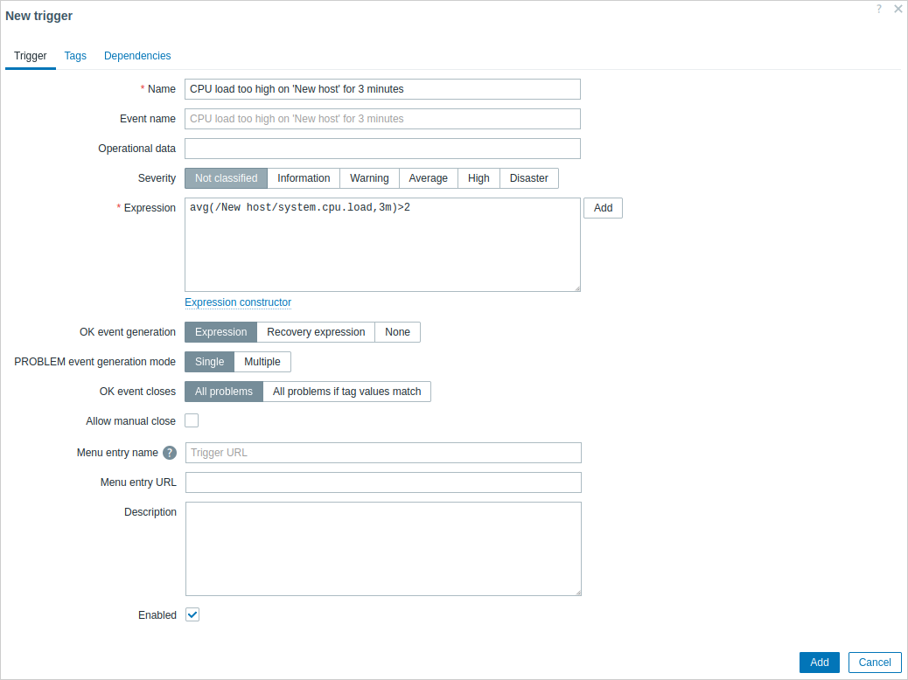
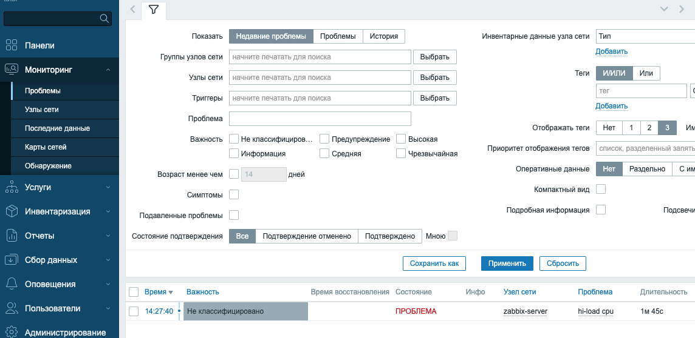

## Модуль 4: Обнаружение и управление проблемами 

**Задание: настройка триггеров и управление проблемами.** 

---
**План:**

- Создайте новый триггер. 
- Настройте зависимости триггеров. 
- Изучите журнал проблем. 

---
### Практическая работа 4.1

#### 1. Создание нового триггера
Для автоматической оценки приходящих данных нам нужно задать триггеры. Триггер содержит выражение, которое определяет порог — что для данных является приемлемым уровнем.
Если приходящие данные превысят этот уровень, триггер «сработает» или перейдёт в состояние «Проблема», давая понять, что произошло что-то, что может потребовать внимания. Если уровень становится снова приемлемым, то триггер возвращается в состояние «ОK».


1.  **Создайте новый триггер:**
- перейдите в `Сбор данных → Узлы сети`, найдите **zabbix-server-<ваше_имя>**, нажмите на `Триггеры` напротив него и затем на `Создать триггер`. Нам будет отображён диалог добавления триггера:
  
- Введите здесь необходимую для нашего триггера информацию:
**Имя**: "Загрузка CPU слишком высокая у 'zabbix-server-<ваше_имя>' в течение 3 минут". Это будет имя триггера, которое будет отображаться в списках и в других местах.
**Выражение**: введите `avg(/zabbix-server-<ваше_имя>/system.cpu.load,3m)>2`
> Чтобы "поймать" проблему, ознакомьтесь с ранее полученым графиком и поставьте свои значения, например 1 минута и порог больше 0.05.

2.  **Просмотр состояния триггера. Обнаружение проблем.**

- Перейдите `Мониторинг → Проблемы`.
  
- Если загрузка CPU превысит порог, который вы указали в триггере, проблема отобразится в строке:

---

#### 2. Настройка зависимости триггеров 

Для выполнения этой практической работы вам прийдется пробросить порт с вашей рабоче станции через ВМ **gw** до ВМ **zabbix-server**, т.к. ВМ **ws** находится в сети 10.0.10.0/24 и не сможет подключится к **zabbix-server**, который расположен в сети 10.0.20.0/24. Пример проброса:
```bash
ssh -L 8080:10.0.20.10:80 student@172.16.110.2
# здесь 172.16.110.2 - адрес вашего gw
# в браузере используйте адрес http://localhost:8080/zabbix/
```
Если это не поможет, используйте в качестве рабочей станции машину 06-winsrv19 (она находится в той же сети что и машина 02-zabbix-server)

Также необходимо на **infra** изменить активные проверки на пассивные. Для этого закомментируйте строки относящиеся к `ServerActive` и в качестве сервера Zabbix укажите Server=10.0.10.1, поменяйте шаблон с активных на пассивные в web-интерфейсе zabbix сервера и проверьте правила фаерволов на узле - должны быть разрешены входящие соединения для zabbix-агента.

1. В настройках виртуальной машины **gw** отключите сетевой интерфейс, который отвечает за подключение  к сети **10.0.10.0/24**.
2. В web-интерфейсе zabbix перейдите в **Мониторинг -> Узлы сети**, нажмите на узел **gw** и выберите **Проблемы**.
3. Запомните имя интерфейса, на котором отмечена **Проблема** (например это **`Linux: Interface ens224: Link down`**).
>**Внимание!** Указанное сообщение о проблеме можно получить, если для узла сети подключен шаблон «Linux by Zabbix agent»

4. В поле **Узлы сети** удалите **gw** и напишите **infra**, затем **Применить**.
5. В списке проблем нажмите на проблему **`Linux: Active checks are not available`** (для появления проблемы возможно прийдется подождать 3-5 минут) и выберите **Настройка: Триггер**.
6. Нажмите на закладку **Зависимости**.
7. Выберите **Добавить**.
8. В поле **Узел сети** впишите **gw**, остальное удалите.
9. В сформированном новом списке ниже найдите 	**`Linux: Interface ens224: Link down`**(смотрите 3-й шаг) и поставьте галочку, затем **выбрать** и **обновить**.
10. Самостоятельно повторите шаги с 5-го по 9-й для проблемы **`Linux: Zabbix agent is not available (or nodata for 30m)`**.
11. Перейдите **Мониторинг -> Проблемы**, в поле **узлы cети** удалите все узлы, в поле **проблемы** напишите **agent** и затем **применить**.
12. В списке проблем не должны отображаться проблемы агента на **infra**.
13. В настройках виртуальной машины **gw** включите сетевой интерфейс, который отвечает за подключение  к сети **10.0.10.0/24**.
---
### Лабораторная работа 4.1

1. Самостоятельно настройте зависимости триггера для проблеммы  **`Linux: Active checks are not available`** и **`Linux: Zabbix agent is not available (or nodata for 3m)`** для хостов **infra**, **winclient** и **zabbix-proxy** от проблемы с отключением сетевого интерфейса (сеть 10.0.10.0/24) на хосте **gw**.
2. Отключите сетевой интерфейс (сеть 10.0.10.0/24) на хосте **gw** и проверьте настройку зависимости.
3. Включите сетевой интерфейс (сеть 10.0.10.0/24) на хосте **gw**.
4. Отключите сетевой интерфейс (сеть 10.0.10.0/24) на хосте **infra** и проверьте настройку зависимости. Проблема не должна пропадать.
5. Включите сетевой интерфейс (сеть 10.0.10.0/24) на хосте **infra**.
6. Перенастройте **infra** снова на использование активного режима агента.
