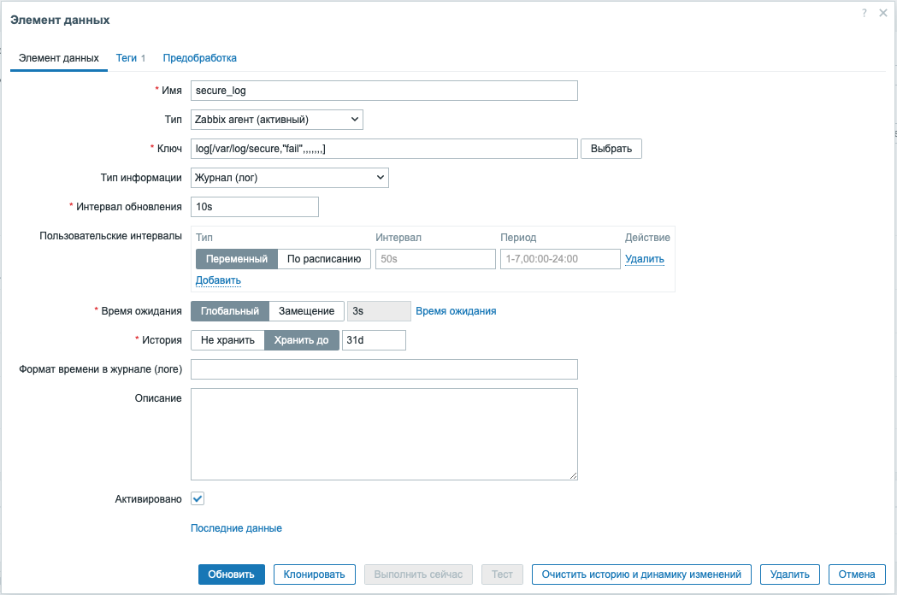

## Модуль 6: Мониторинг различных систем 

---

**Задание: Настройка мониторинга SNMP, баз данных**

---
**План:**  

- Настройка мониторинга SNMP 
- Настройка параметров SNMP
- Настройка мониторинга баз данных
- Настройка параметров мониторинга баз данных 
- Создайте вычисляемый элемент. 
- Настройте параметры вычисляемого элемента. 

---

### 1. Настройка мониторинга SNMP 

1. Перейдите в раздел **Сбор данных -> Узлы сети** в интерфейсе Zabbix. 
2. Нажмите кнопку **Создать узел сети**. 
3. Заполните поля формы, указав имя хоста, шаблон, IP-адрес и группу.
- Имя: Mikrotik
- Шаблон: Mikrotik by SNMP
- Адрес: 10.0.20.99 
- Группа: router, vasha_familia
- Интерфейс: SNMP
- Версия SNMP: 1 
Сохраните настройки. 

4. Дождитесь когда в списке узлов в строке **Mikrotik** загорится зеленым значек **SNMP**
5. Перейдите в раздел **Мониторинг -> Узлы сети** в интерфейсе Zabbix. Найдите узел **Mikrotik** и нажмите на графики
6. Подключитесь из **WINCLIENT** к Mikrotik с помощью **WinBox**(admin/zabbix) выберите меню **Files** в Winbox и загрузите любой файл размером от 10 до 30Мб
7. Переключитесь обратно на интерфейс Zabbix и убедитесь что график загрузки сетевых интерфейсов изменяется.

---

### 2. Настройка мониторинга баз данных

1. Подключитесь к **zabbix-db**
2. Включите нужные плагины, для мониторинга Postgresql, для этого установите пакет `zabbix-agent2-plugin-postgresql.x86_64` и отредактируйте файл `/etc/zabbix/zabbix_agent2.d/plugins.d/postgresql.conf`:  
   ```
   Plugins.PostgreSQL.Default.Databases=zabbix
   Plugins.PostgreSQL.Default.User=zbx_monitor
   Plugins.PostgreSQL.Default.Password=zabbix
   ```  

> Обязательно ознакомьтесь с инструкцией для плагина для добавления пользователя и макросов в узел хоста **zabbix-db**
   Setup:
>
> 1. Deploy Zabbix agent 2 with the PostgreSQL plugin. Starting with Zabbix versions 6.0.10 / 6.2.4 / 6.4 PostgreSQL metrics are moved to a loadable plugin and require installation of a separate package or compilation of the plugin from sources (https://www.zabbix.com/documentation/7.0/manual/extensions/plugins/build).
>
> 2. Create the PostgreSQL user for monitoring (`<password>` at your discretion) and inherit permissions from the default role `pg_monitor`:
>```
>CREATE USER zbx_monitor WITH PASSWORD '<PASSWORD>' INHERIT;
>GRANT pg_monitor TO zbx_monitor;
>```
>```bash
>#на серевере zabbix_db
>sudo -u postgres psql
>CREATE USER zbx_monitor WITH PASSWORD 'zabbix' INHERIT;
>GRANT pg_monitor TO zbx_monitor;
>exit
>```
> 3. Edit the `pg_hba.conf` configuration file to allow connections for the user `zbx_monitor`. You can check the PostgreSQL documentation for examples (https://www.postgresql.org/docs/current/auth-pg-hba-conf.html).
>```ini
># TYPE  DATABASE        USER            ADDRESS                 METHOD
>host    all             all             10.0.20.0/24            md5
>```
>Для проверки подключитесь с **zabbix-server**
>```bash
>student@zabbix-server ~ [1]> psql -h 10.0.20.3 -U zbx_monitor -d postgres
>Пароль пользователя zbx_monitor:
>psql (17.2)
>Введите "help", чтобы получить справку.
>
>postgres=> exit
>```
> 4. Set the connection string for the PostgreSQL instance in the `{$PG.CONNSTRING.AGENT2}` macro as URI, such as `<protocol(host:port)>`, or specify the named session - `<sessionname>`.

3. В веб-интерфейсе выберите узел **zabbix-db** и перейдите в настройку узла.
4. Добавьте шаблон **PostgreSQL by Zabbix agent 2**
5. Перйдите в настройку шаблона **PostgreSQL by Zabbix agent 2** нажав на его имя и выберите макросы
6. Заполните поля:
- `{$PG.CONNSTRING.AGENT2}`: `tcp://localhost:5432`
- `{$PG.DATABASE}`: `postgres`
- `{$PG.PASSWORD}`: `zabbix`
- `{$PG.USER}`: `zbx_monitor`

7. Перезапустите агент:  
   ```bash
   sudo systemctl restart zabbix-agent2
   sudo systemctl enable zabbix-agent2

8. Проверьте журнал zabbix-агента на сервере **zabbix-db**, ошибок подключения быть не должно.
9. Отключите сбор устаревших метрик
Если овидите ошибку **pgsql.bgwriter**, можно отключить метрики pgsql.bgwriter в настройках Zabbix:
- Откройте веб-интерфейс Zabbix.
- Перейдите в **Мониторинг → Узлы сети**.
- Выберите сервер **zabbix-db**.
- Перейдите в **Элементы данных** (Items).
- Найдите **pgsql.bgwriter** и отключите его.

10. Проверьте полученные данные по работе сервера БД:
- Откройте веб-интерфейс Zabbix.
- Перейдите в **Мониторинг → Узлы сети**.
- Найдите сервер **PostgreSQL** и выберите **Панели**
- Найдите во втором ряду слева панель **`DB [{#DBNAME}]: Size`** и переключите базу на **zabbix**(`<1/2>` нажать на символ `>`).

11. Вы должны увидеть собранную статистику по базе **zabbix**

---

### 3. Создание вычисляемого элемента

**Вычисляемый элемент** (Calculated item) в Zabbix позволяет выполнять вычисления на основе данных, полученных от других элементов.  

1. Откройте настройки узла сети или шаблона
2. Перейдите в **Мониторинг → Узлы сети**.  
3. Выберите хост **zabbix-db**.  
4. Перейдите во вкладку **Items (Элементы данных)**.  
5. Нажмите **Create item (Создать элемент данных)**.  

6. Настройте вычисляемый элемент
Заполните основные поля:  

- **Name (Имя)** → Например: `Средняя загрузка CPU за 5 минут`  
- **Type (Тип)** → `Calculated` (**Вычисляемый**)  
- **Key (Ключ)** → Например: `cpu.load.avg5`  
- **Formula (Формула вычислений)** → Используйте другие элементы данных:  

  ```plaintext
  avg(//system.cpu.load,5m)
  ```

- `avg(//system.cpu.load,5m)` — среднее значение загрузки CPU за 5 минут.  
- `last(//vfs.fs.size[/,free])` — последнее значение свободного места на диске `/`.  

- **Units (Единицы измерения)** → Укажите единицы, например `%` или `MB`.  
- **Update interval (Интервал обновления)** → Например, `60s` (каждую минуту).  

7. Сохраните и протестируйте.
8. Нажмите **Add (Добавить)**.  
9.  Перейдите в **Мониторинг → Latest data**.  
10. Найдите ваш элемент и убедитесь, что данные обновляются.  

---

### 4. Настройка сбора данных инвентаризации 
1. Перейдите в раздел **Мониторинг → Узлы сети** и выберите хост **zabbix-db**. 
2. В разделе «Инвентаризация» заполните необходимые поля (например, имя, местоположение, серийный номер и т.д.). 
3. Сохраните настройки. 
---
### 5. Настройте мониторинг файлов журналов 

Мониторинг файлов журналов помогает отслеживать ошибки и предупреждения.  

1. Откройте Zabbix и перейдите в раздел **Мониторинг → Узлы сети** и выберите хост **gw** и создайте новый **Элемент данных**
2. Назовите элемент **secure_log**
3. Укажите путь к файлу журнала на сервере и настройте правила для поиска определенных сообщений (например, ошибок или предупреждений). 
4. Ключ: `log[/var/log/secure,"fail",,,,,,,]`
5. Укажите частоту проверки файлов журналов. В качестве примера воспользуейтесь скриншотом:


6. В тег добавьте student=fasha_familia
7. Сохраните настройки и активируйте элемент.
8. Проверьте последние данные для нового элемента, если видите ошибку доступа, то добавьте права доступа к файлу журнала для пользователя zabbix с помощью комманды `setfacl` на сервере **gw**.
9.  Попробуйте подключиться к серверу **gw** по ssh под несуществующим пользователем в **Мониторинг → Последние данные** должно появится запись журнала c текстом 

`gw sshd[148725]: PAM 2 more authentication failures`

---

### Лабораторная работа
1. Создайте самостоятельно для сервера **gw** отслеживание слова **"invalid"**  в журнале `/var/log/secure` создав элемент **secure_log invalid**
