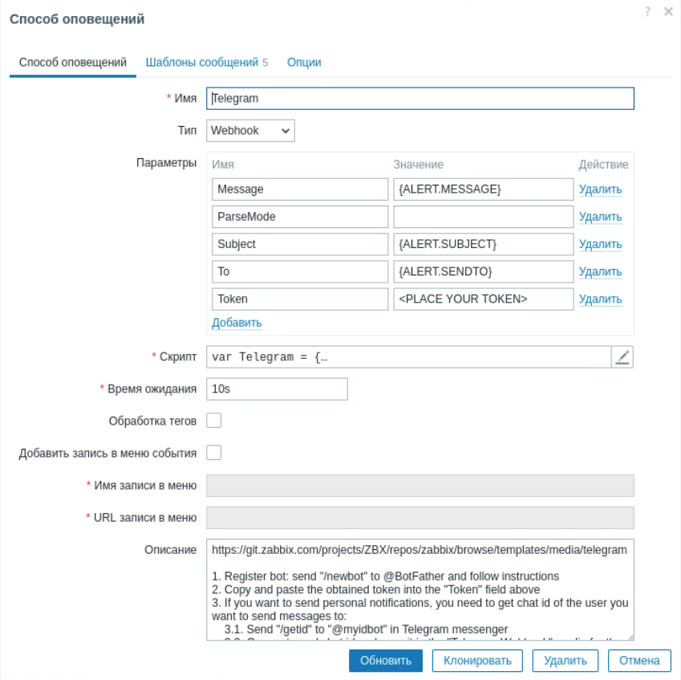
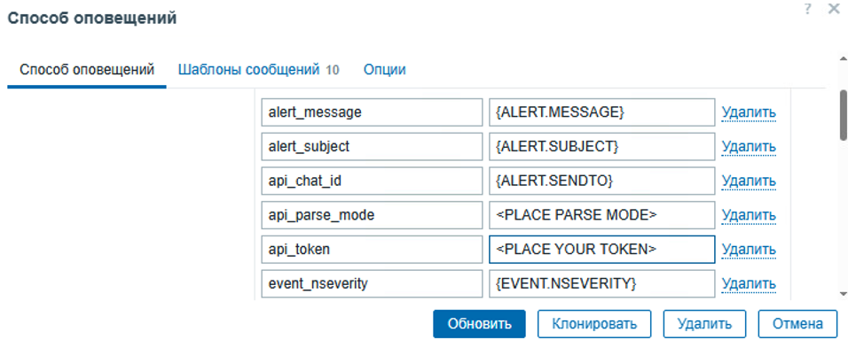
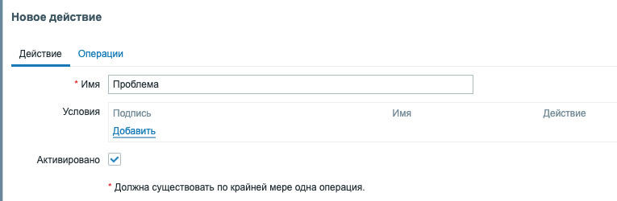
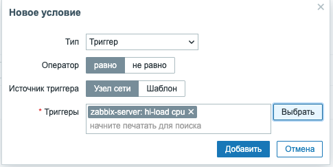
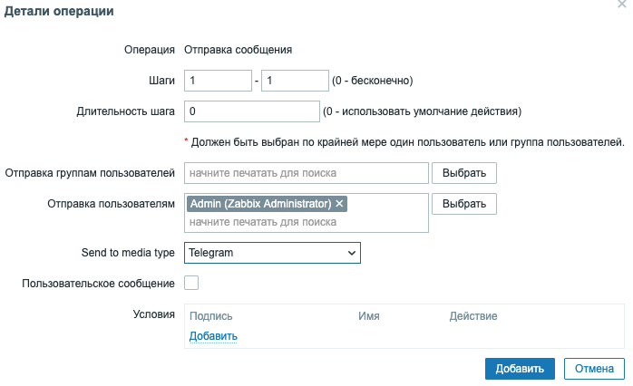
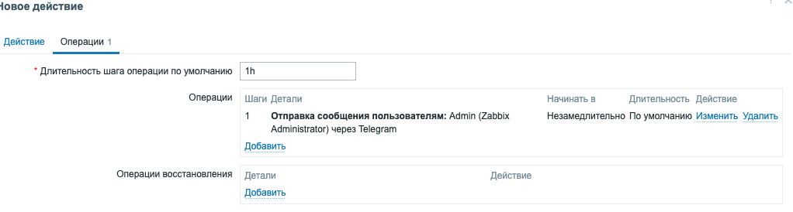
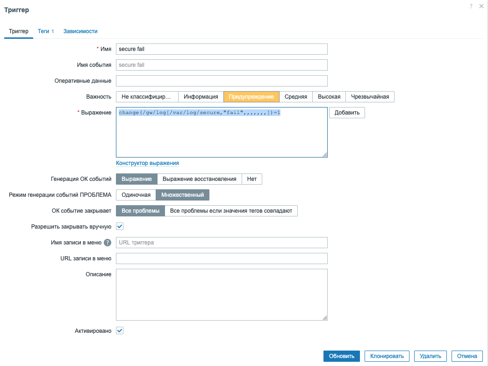
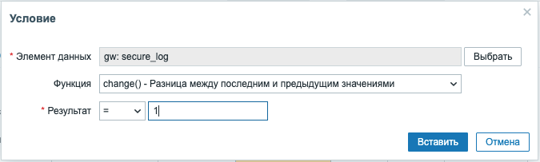

## Модуль 7: Управление пользователями и уведомления

---

**Задание: настройка управления пользователями и уведомлений.**
---
**План**  

- Настройка Telegram. 
- Настройка профиля пользователя.
- Настройка оповещения о проблемах.

---
### Практическая работа 7.1

#### 1. Настройка уведомлений

1. **Настройте уведомления:**
> Предварительно получите данные от тренера для настройки уведомлений в Telegram (для получения токена можно самостоятельно создать Telegram-бот ***см. Приложение 3***)

- перейдите в **Оповещения -> Способы оповещений**
  

- выберите **Telegram** и `активируйте` его

- нажмите на ссылку **`Telegram`** , чтобы перейти в настройки
- укажите токен в поле `Параметры - Token:`

- нажмите **`Обновить`**.

2. **Настройте персонализированный профиль пользователя:**
- перейдите в настройки профиля, чтобы обновить информацию о пользователе и сохраните изменения:

- на вкладке `Пользователь` установите ваш локальный часовой пояс;
- на вкладке `Оповещения` нажмите `Добавить` и выберите `Telegram`;
- В поле `Отправлять на` Укажите ID чата и нажмите `Добавить`;

- нажмите `обновить` 
  

---

#### 2. Получение оповещения о проблеме

1.  **Настройте действие:**
- для настройки оповещений перейдите в `Оповещения → Действия → Действия триггеров` и нажмите на `Создать действие`.

- все обязательные поля ввода отмечены красной звёздочкой.Введите имя действия;
- в поле Условия нажмите добавить и выберите свой триггер и сервер:

- нужно определить, что именно действие должно делать — это настраивается на вкладке `Операции`. Нажмите в блоке `Операции` на `Добавить`, откроется диалог новой операции. 

- нажмите на `Выбрать` в блоке `Отправка пользователям` и выберите пользователя **«Admin»**, которого мы добавили. В поле `Отправлять способом оповещения` выберите значение **«Telegram»**: 
  
- когда закончите с этим, нажмите на `Добавить`, и операция добавится:

---

#### Лабораторная работа 7.1

1. Добавьте для сервера **gw** новый триггер с именем "Secure fail" и заполните поля как в примере:

2. Поле **Выражение** заполните как в примере, нажав кнопку **Добавить**

3. Добавьте для сервера **gw** новый триггер с именем "Secure invalid user" **secure_log invalid**
4. Создайте  новое **Уведомление**, которое будет отправлять сообщение в Telegram о неправильных подключениях по ssh на основе созданных триггеров "Secure fail" и "Secure invalid user".
5. Подключитесь по ssh под пользователем VASHA_FAMILA к серверу **gw**, чтобы проверить настройки уведомлений.
